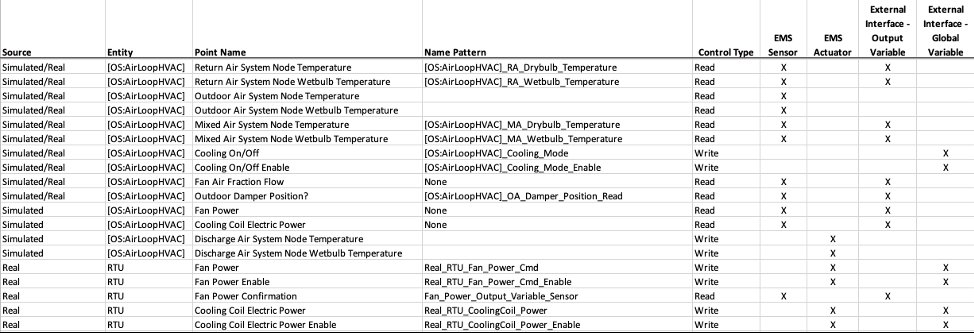
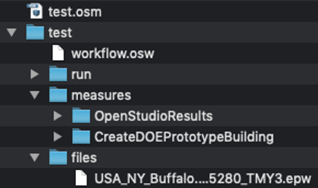
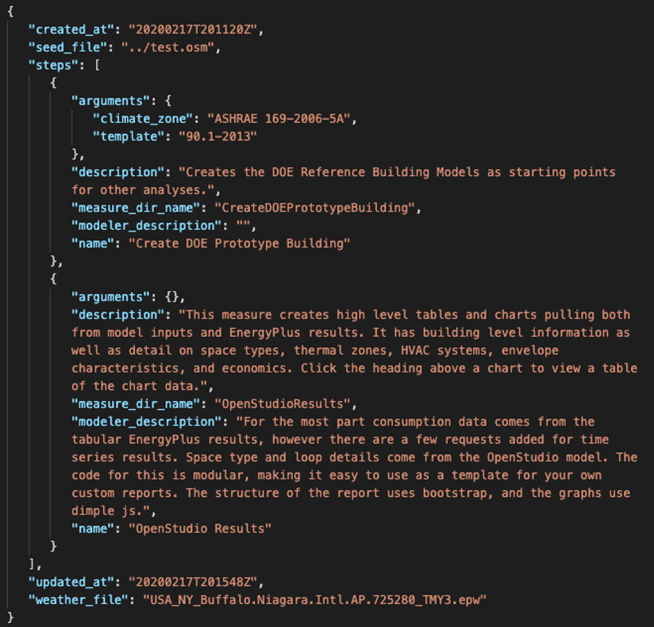
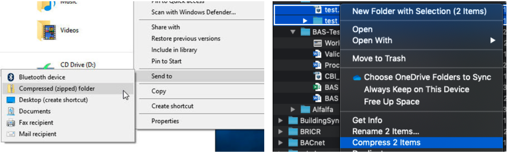

# Introduction to Alfalfa

The main goals of Alfalfa include the following:
1.	Provide a RESTful interface for co-simulation through which an OpenStudio/EnergyPlus or Modelica model can be interacted with.  Alfalfa supports upload of osw, fmu, or zip (a zipped-up version of the OpenStudio workflow directory structure) files.
2.	Support large-scale parallel building simulation using commodity cloud computing resources such as AWS.
3.	To convert model objects (such as fans, airloops, sensing points, etc.) into Haystack entities using the Haystack metadata model.
4.	Expose these Haystack entities via the Haystack API to enable ‘virtual’ buildings to be interacted with in a similar manner to an actual building.
5.	Provide a RESTful interface for uploading, starting, and stopping simulation(s), as well as a simple user interface for these tasks.

A few important caveats to understand about Alfalfa:
1.	While it enables simulations to be interacted with during runtime, it does not specifically coordinate co-simulation (i.e. ensuring models are time coordinated, that inputs/outputs are coordinated, etc.).
2.	Alfalfa is designed to step through model time at 1-minute intervals for EnergyPlus models, however, the way that the simulation steps through real time varies and is discussed below.  It is mainly designed to step through a model in three different ways.
3.	Alfalfa uses a start and ending datetime to drive the simulation.  For EnergyPlus, these get written into the IDF file before run.  If none are specified, they will default to January 1st, 00:00:00 and December 31st, 23:59:00.
4. While the goal of Alfalfa is to convert model objects into Haystack entities, this does not get done for all things.

## OpenStudio Objects into Haystack Points
Currently, the [haystack-measure](../worker/workflow/measures/haystack/measure.rb), when run after creating a typical OpenStudio model (via Create DOE Prototype), will generate the following:
- model.getBuilding -> 'site' entity
- model.weatherFile.get -> 'weather' entity
- airloop = model.getAirLoopHVACs -> 'ahu' entity
	- discharge_air_node = airloop.supplyOutletNode -> Node Points added to 'ahu'
	- sc = airloop.supplyComponents
		- If not UnitarySystem:
			- oa_damper = sc.getControllerOutdoorAir -> Add OA damper points to 'ahu'
			- mixed_air_node = sc.mixedAirModelObject -> Node Points added to 'ahu'
			- outdoor_air_node = sc.outdoorAirModelObject -> Node Points added to 'ahu'
			- return_air_node = sc.returnAirModelObject -> Node Points added to 'ahu'
			- relief_air_node = sc.reliefAirModelObject -> Node Points added to 'ahu'
			- if sc.to_Fan_ConstantVolume -> Constant Volume Fan added to 'ahu'
			- if sc.to_FanVariableVolume -> Variable Volume Fan added to 'ahu'
			- if sc.to_FanOnOff -> Variable Volume Fan added to 'ahu'
			- if sc.to_CoilCoolingWater -> 'ahu' typed as chilledWaterCool, ref to plant loop created
			- if sc.to_CoilHeatingWater -> 'ahu' typed as hotWaterHeat, ref to plant loop created
			- if sc.to_CoilHeatingWater -> 'ahu' typed as hotWaterHeat, ref to plant loop created
			- if sc.to_CoilHeatingElectric -> 'ahu' typed as elecHeat, ref to plant loop created
		- If UnitarySystem:
			- Similar to if not UnitarySystem
	- dc = airloop.demandComponents
		- tz = dc.to_ThermalZone -> 'zone' entity created, zone points created
		- equip = tz.equipment ->
			- equip.to_AirTerminalSingleDuctVAVReheat -> 'vav' entity created, 'ahu' typed as 'vavZone', equipRef to 'ahu' created
			- rc = equip.to_AirTerminalSingleDuctVAVReheat.get.reheatCoil
				- if rc.to_CoilHeatingWater -> 'vav' typed as 'hotWaterReheat'
				- if rc.to_CoilHeatingElectric -> 'vav' typed as 'elecReheat'
			- equip.to_AirTerminalSingleDuctUncontrolled -> 'ahu' typed as 'directZone', equipRef to 'ahu' created

### Node Points
- Air Temp Sensor (READ)
- Air Pressure Sensor (READ)
- Air Humidity Sensor (READ)
- Air Flow Sensor (READ)

### Outdoor Air Points
- Outside Air Damper CMD (WRITE)
- Outdoor Air Damper Sensor Position (READ)
- Outside Air Mass Flow Rate

### Zone Points
- Zone Air Temp Sensor (READ)
- Zone Air Humidity Sensor (READ)
- Zone Air Heating Sp
- Zone Air Cooling Sp

### Zone Equipment Points
- Entering Air Temp Sensor (READ)
- Discharge Air Temp Sensor (READ)


See the [SmallOffice](SmallOffice%20Example.md) and [MediumOffice](MediumOffice%20Example.md) files for more information.

## Guidance on Choosing a Simulation Engine
Users coming to Alfalfa likely have different backgrounds - some will come from a purely controls world, others from an energy modeling world using OpenStudio/EnergyPlus, and maybe others from the Modelica world.  There are distinct advantages and disadvantages to both from an Alfalfa perspective.

### EnergyPlus
Using the E+ simulation engine has distinct advantages in terms of the tooling availabe to quickly and easily generate models, typical systems, etc. (namely, OpenStudio or Eppy).  That said, in order to make controls work as expected in real-life, custom EMS code must currently be developed to enable controls to behave as expected (see [Alfalfa Control](#alfalfa-control)).

### Modelica
While the Modelica Buildings Library is currently being built up, there is significantly less tooling available.  Most models will need to be generated by hand and significant understanding of the Modelica language is required for proficiency.  That said, Modelica is significantly more robust in implementing controllability to an energy model that is in line with how real systems operate.

# Stepping Through Simulations
## Advance via an external call
1.	In this scenario, the model will only advance when explicitly told to advance by an external call.  It has no regard for real time passing but sits in an idle state until told to advance.  The simulation starts at the specified start time.
2.	Upon call to advance, Alfalfa will look for any points written from external sources, write these into the simulation, and advance the simulation one time step (1-minute in model time).
3.	It then waits to advance until the next call is made.
4.	It will stop if the model has advanced enough times such that the end datetime has passed or if it is specifically told to stop.

## Advance at a specified timescale
1.	In this scenario, the timescale parameter is used to control the rate at which the internal clock advances through the simulation.  It represents the integer ratio of model_time:real_time.  For example, a value of 5 means that the simulation will advance at 5x the rate of real time.  In other words, one minute of simulation time will occur every 12 seconds of real time.
2.	Regardless of the start time specified for the run, the simulation will begin running.
3.	Upon reaching the time to advance, Alfalfa will look for any points from external sources, write these into the simulation, and advance the simulation one time step (1-minute in model time).
4.	It then waits X time in real time before advancing through the next time step.
5.	It will proceed until it has reached the specified end datetime or if it is specifically told to stop.
6.	All external calls to advance the simulation are ignored.

## Advance in real time
1.	This scenario is similar to the timescale with the following caveats.
2.	The timescale parameter is always one (i.e. the model advances one minute in model time for every one minute that passes in real time).
3.	If the specified model start time has already passed in real time, the start time will be overwritten to the current time and the simulation will begin.  However, if the specified model start time has not already passed in real time, the simulation will not begin until that time in real time is reached.
4.	It will then proceed until it has reached the specified end datetime or if it is specifically told to stop.
5.	All external calls to advance the simulation are ignored.

# Alfalfa Control
One of the more important aspects to understand about Alfalfa is that the actual control implementation is completely dependent on the underlying simulation engine used.  While time delays, PID loops, etc. can be exposed if running a simulation with a Modelica model, these do not exist in EnergyPlus.  As EnergyPlus’ default run logic is to meet loads at all times within capacity constraints, this is not necessarily how control would be implemented in the real world and generally deviates from expectations, especially for those familiar with real world controls and limited background with simulation tools.  This isn’t to say that writing to a point exposed by Alfalfa can’t have the desired effect in simulation, rather, EnergyPlus experience is needed to:
1. Understand the underlying simulation calculation and run order
2. Design Energy Management System (EMS) logic that works behind the scenes of Alfalfa, such that writing to an exposed point has the intended effects.


## Control Descriptions
Therefore, it is best practice to provide pseudocode or a narration document of expected equipment run logic such that strategies to implement this control using EMS and Erl can be discussed and appropriately developed.  As part of generating the pseudocode, users should answer the following:
- Which equipment am I planning on controlling / interfacing with?
- What points am I expecting to be able to read from during the simulation?
- Which points am I expecting to write to during the simulation AND what is their desired effect on the simulation during run?
- At what point during the simulation should the write points be evaluated?  Refer to the EMS Application Guide – Chapter 6 for information on EMS Calling Points.
- What other logic am I expecting out of the simulation engine after reading from / writing into?

At the end of this task, project teams should have developed a comprehensive equipment and points list, while also identifying whether those points will be read or write points.  An example of this is shown below:


# OpenStudio Models

## Setting up an OSM
This section focuses on the OpenStudio modeling requirements and describes how to create readable and writeable points in OpenStudio so that Alfalfa can create the ExternalInterface objects.  This DOES NOT define how the appropriate tags should be applied to 'type' something.  That is TODO.
### Readable Points
The following steps should be taken in the OpenStudio model in order to expose readable points from simulation to Alfalfa to acquire ExternalInterface objects needed for co-simulation, as well as Project Haystack points with tags associated with the readable points:
1.	Create an OutputVariable object for the simulation point whose value you wish to read
2.	Set the OutputVariable object attributes including name, reporting frequency, and key value as required
3.	Set the exportToBCVTB method to true

### Writeable Points
The following steps should be taken in the OpenStudio model in order to expose writeable points in simulation to Alfalfa in order to acquire ExternalInterface objects needed for co-simulation, as well as Project Haystack points and tags associated with the writeable points.
1.	Create two (2) EnergyManagementSystemGlobalVariable objects for the simulation actuator point you wish to expose
2.	Set the name of the first object (e.g. “Fan_Mass_Flow”)
3.	Set the name of the second object the same as the first but include “_enable” (e.g. “Fan_Mass_Flow_enable”)
4.	Set exportToBCVTB method to true for both
The following steps should be taken in the OpenStudio model EnergyManagementSystem Programs and Subroutines that reference this writeable point:
1.	EnergyPlus EMS Programs and Subroutines should reference the “NAME_enable” variable by String name whose Boolean value (True or False) dictates whether or not EnergyPlus should write the value from Alfalfa to the associated EnergyPlus EMS actuator. For example:
```
IF Fan_Mass_Flow_enable ==1
	SET EMS_fanmassflow_actuator = Fan_Mass_Flow
ELSE,
	SET EMS_fanmassflow_actuator = Null
ENDIF,
```
Where 1 is True and 0 is False.

### Setting up an OSW
Assuming that the OpenStudio Model has been set up with the above requirements, an OpenStudio Workflow can easily be implemented.  The workflow can be designed using the OpenStudio application or by correctly defining a directory structure with the necessary components.  For those familiar with creating workflows, this is the standard directory structure, and is shown in the photo below.  It also generally takes the form:
- path/to/my_model.osm
- path/to/my_model/workflow.osw
- path/to/my_model/measures/…[insert measure directories]
- path/to/my_model/files/desired_weather_file.epw

 

An example of the workflow.osw is also provided below:

 

Once the workflow has been setup, the model and model directory simply need to be zipped together.  For both Windows and macOS, select the model and model directory, then right click, and see photos below for compressing:



This zipped folder can then be directly uploaded to Alfalfa.

# Designing Control Tests
To support this, the project team should develop a few (1-3) experiment specific tests, which should be highly aligned to the actual experiment.  These tests could be as simple as the following:
1.	 Turn an RTU fan on/off.  After actuating control point, the energy consumption is expected to increase/decrease and we expect to see air flow at the RTU discharge sensor.
2.	Turn the heating/cooling stages to stage 1, then stage_2.  After turning the heating on, we expect the discharge air temperature to increase and for the zone air temperature to increase over time.  Similar for cooling.
After defining the control tests, they can be implemented, the data historized, and then visualized using the Alfalfa python client  (or any other client).  This will help experimentalists test and verify their experiment design and modeling implementation.
