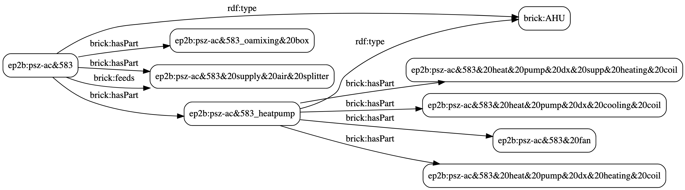

# Generate BRICK models from EnergyPlus building models

This utility parses an EnergyPlus IDF, finds its components and builds a BRICK model for the modelled building.
The output is a Turtle file that describes the building.

# This is still a prototype!

This work is still experimental. Do not expect this program to work with any IDF you might pass to it. Many EnergyPlus objects have not been implemented yet.

## Current status

This program can parse:
- the DOE Prototype small office building (STD 90.1 2013)
- the DOE Prototype medium office building (SDT 90.1 2013)

Yet, this program does not parse all the building. It will only:
- generate BRICK descriptions of the air handling units (AHUs)
- generate BRICK descriptions of thermal zones
- define relationships between AHU components (hasPart, isPartOf, feeds, isFedBy) and thermal zones

## Work in progress

This is the list of items that are being taken care of:
- detect sensor and control points, if specified in the IDF
- generate basic sensor and control points, if not specified in the IDF
- expand the list of EnergyPlus objects that are detectable

And someday:
- write the documentation

# How to run this prototype

Head to [this Jupyter Notebook](doc/quickstart.ipynb) for a quick introduction on how to use this program.